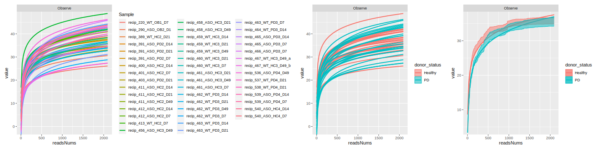
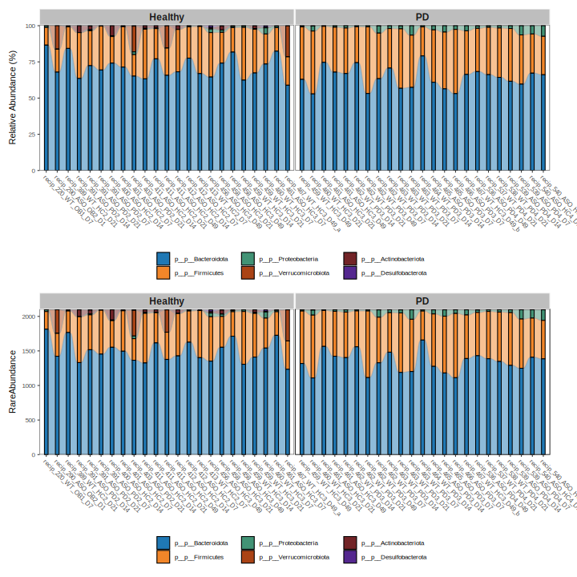
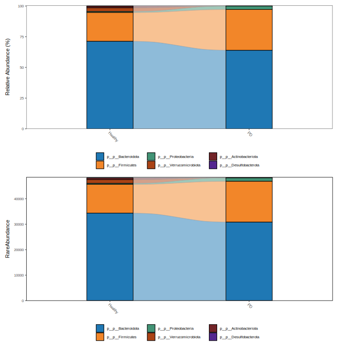
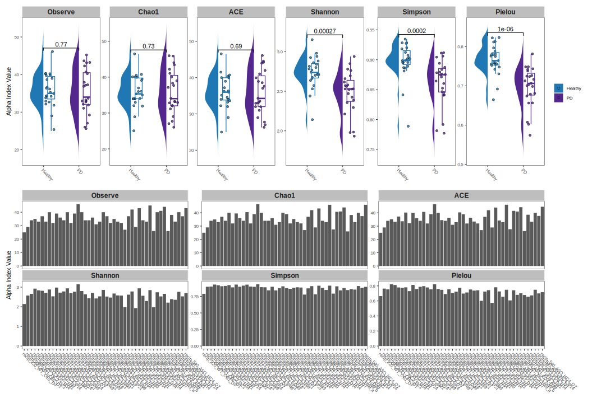
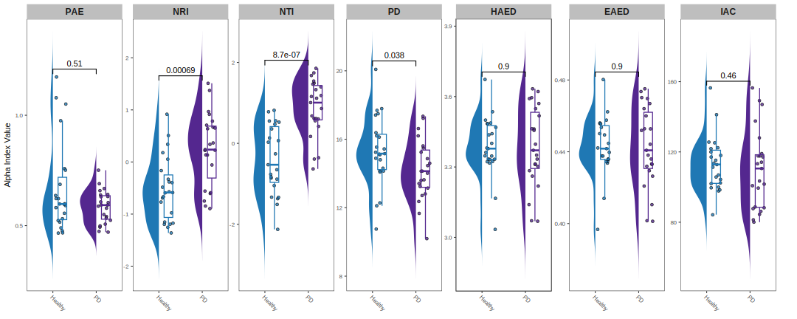

## Microbiota Process and Visualization Pipeline based on the MicrobiotaProcess R Package

### Overview

<div align=center></div>

### Installation

```bash
➤ git clone https://github.com/ohmeta/mpsepi
➤ echo "PYTHONPATH=/path/to/mpsepi:$PYTHONPATH" >> ~/.bashrc
# relogin
```

### Overview

```bash
➤ python /path/to/mpsepi/run_mpsepi.py --help

usage: mpsepi [-h] [-v]  ...

 ▄▄       ▄▄  ▄▄▄▄▄▄▄▄▄▄▄  ▄▄▄▄▄▄▄▄▄▄▄  ▄▄▄▄▄▄▄▄▄▄▄  ▄▄▄▄▄▄▄▄▄▄▄  ▄▄▄▄▄▄▄▄▄▄▄
▐░░▌     ▐░░▌▐░░░░░░░░░░░▌▐░░░░░░░░░░░▌▐░░░░░░░░░░░▌▐░░░░░░░░░░░▌▐░░░░░░░░░░░▌
▐░▌░▌   ▐░▐░▌▐░█▀▀▀▀▀▀▀█░▌▐░█▀▀▀▀▀▀▀▀▀ ▐░█▀▀▀▀▀▀▀▀▀ ▐░█▀▀▀▀▀▀▀█░▌ ▀▀▀▀█░█▀▀▀▀
▐░▌▐░▌ ▐░▌▐░▌▐░▌       ▐░▌▐░▌          ▐░▌          ▐░▌       ▐░▌     ▐░▌
▐░▌ ▐░▐░▌ ▐░▌▐░█▄▄▄▄▄▄▄█░▌▐░█▄▄▄▄▄▄▄▄▄ ▐░█▄▄▄▄▄▄▄▄▄ ▐░█▄▄▄▄▄▄▄█░▌     ▐░▌
▐░▌  ▐░▌  ▐░▌▐░░░░░░░░░░░▌▐░░░░░░░░░░░▌▐░░░░░░░░░░░▌▐░░░░░░░░░░░▌     ▐░▌
▐░▌   ▀   ▐░▌▐░█▀▀▀▀▀▀▀▀▀  ▀▀▀▀▀▀▀▀▀█░▌▐░█▀▀▀▀▀▀▀▀▀ ▐░█▀▀▀▀▀▀▀▀▀      ▐░▌
▐░▌       ▐░▌▐░▌                    ▐░▌▐░▌          ▐░▌               ▐░▌
▐░▌       ▐░▌▐░▌           ▄▄▄▄▄▄▄▄▄█░▌▐░█▄▄▄▄▄▄▄▄▄ ▐░▌           ▄▄▄▄█░█▄▄▄▄
▐░▌       ▐░▌▐░▌          ▐░░░░░░░░░░░▌▐░░░░░░░░░░░▌▐░▌          ▐░░░░░░░░░░░▌
 ▀         ▀  ▀            ▀▀▀▀▀▀▀▀▀▀▀  ▀▀▀▀▀▀▀▀▀▀▀  ▀            ▀▀▀▀▀▀▀▀▀▀▀

      Omics for All, Open Source for All

      Microbiome data process and visualization pipeline

optional arguments:
  -h, --help     show this help message and exit
  -v, --version  print software version and exit

available subcommands:

    init         init project
    mpse_wf      microbiome data process and visualization pipeline
```

### Input requirements

#### DADA2

- metadata.tsv file
- seqtab.rds file
- taxa.rds file
- ref.tree file (optional)

#### QIIME2

- metadata.tsv file
- otu.qza
- taxa.qza
- tree.qza (optional)

#### Metaphlan/mOTU/KMCP

- metadata.tsv file
- profile

#### PICRUSt2
- ec_pred_metagenome_unstrat.tsv.gz
- ko_pred_metagenome_unstrat.tsv.gz
- path_abun_unstrat.tsv.gz

### Example (QIIME2-PD-mice)

#### Prepare data

```bash
➤ mkdir -p pd-mice
➤ cd pd-mice
➤ wget -c https://data.qiime2.org/2022.11/tutorials/pd-mice/sample_metadata.tsv
➤ wget -c https://docs.qiime2.org/2022.11/data/tutorials/pd-mice/dada2_table.qza
➤ wget -c https://docs.qiime2.org/2022.11/data/tutorials/pd-mice/taxonomy.qza
➤ wget -c https://docs.qiime2.org/2022.11/data/tutorials/pd-mice/tree.qza
```

#### Init project

```bash
➤ python /path/to/mpsepi/run_mpsepi.py init -d .


 ▄▄       ▄▄  ▄▄▄▄▄▄▄▄▄▄▄  ▄▄▄▄▄▄▄▄▄▄▄  ▄▄▄▄▄▄▄▄▄▄▄  ▄▄▄▄▄▄▄▄▄▄▄  ▄▄▄▄▄▄▄▄▄▄▄
▐░░▌     ▐░░▌▐░░░░░░░░░░░▌▐░░░░░░░░░░░▌▐░░░░░░░░░░░▌▐░░░░░░░░░░░▌▐░░░░░░░░░░░▌
▐░▌░▌   ▐░▐░▌▐░█▀▀▀▀▀▀▀█░▌▐░█▀▀▀▀▀▀▀▀▀ ▐░█▀▀▀▀▀▀▀▀▀ ▐░█▀▀▀▀▀▀▀█░▌ ▀▀▀▀█░█▀▀▀▀
▐░▌▐░▌ ▐░▌▐░▌▐░▌       ▐░▌▐░▌          ▐░▌          ▐░▌       ▐░▌     ▐░▌
▐░▌ ▐░▐░▌ ▐░▌▐░█▄▄▄▄▄▄▄█░▌▐░█▄▄▄▄▄▄▄▄▄ ▐░█▄▄▄▄▄▄▄▄▄ ▐░█▄▄▄▄▄▄▄█░▌     ▐░▌
▐░▌  ▐░▌  ▐░▌▐░░░░░░░░░░░▌▐░░░░░░░░░░░▌▐░░░░░░░░░░░▌▐░░░░░░░░░░░▌     ▐░▌
▐░▌   ▀   ▐░▌▐░█▀▀▀▀▀▀▀▀▀  ▀▀▀▀▀▀▀▀▀█░▌▐░█▀▀▀▀▀▀▀▀▀ ▐░█▀▀▀▀▀▀▀▀▀      ▐░▌
▐░▌       ▐░▌▐░▌                    ▐░▌▐░▌          ▐░▌               ▐░▌
▐░▌       ▐░▌▐░▌           ▄▄▄▄▄▄▄▄▄█░▌▐░█▄▄▄▄▄▄▄▄▄ ▐░▌           ▄▄▄▄█░█▄▄▄▄
▐░▌       ▐░▌▐░▌          ▐░░░░░░░░░░░▌▐░░░░░░░░░░░▌▐░▌          ▐░░░░░░░░░░░▌
 ▀         ▀  ▀            ▀▀▀▀▀▀▀▀▀▀▀  ▀▀▀▀▀▀▀▀▀▀▀  ▀            ▀▀▀▀▀▀▀▀▀▀▀


      Omics for All, Open Source for All

      Microbiome data process and visualization pipeline


      Thanks for using mpsepi.

      A microbiome analysis project has been created at /home/jiezhu/toolkit/mpsepi/test/test_mpsepi_dev


      if you want to create fresh conda environments:

      mpsepi mpse_wf --conda-create-envs-only

      if you have environments:

      mpsepi mpse_wf --help

```

#### Update config.yaml

Please update `input::metadata` to `/path/to/sample_metadata.tsv`, update `input::qiime2::otuqzafile` to `/path/to/dada2_table.qza`, and update `input::qiime2::taxaqzafile` to `/path/to/taxonomy.qza`, and update `input::qiime2::treeqzafile` to `/path/to/tree.qza`

```bash
➤ cat config.yaml

input:
  metadata: /path/to/sample_metadata.tsv

  dada2:
    seqtabfile: /path/to/seqtab.rds
    taxafile: /path/to/taxa.rds
    reftreefile: /path/to/reftree.tree

  qiime2:
    otuqzafile: /path/to/otu.qza
    taxaqzafile: /path/to/taxa.qza
    treeqzafile: /path/to/tree.qza

  metaphlan:
    profile: /path/to/metaphlan_profile.tsv # all level or species level

  picrust2:
    ecprofile: /path/to/picrust2/EC_metagenome_out/pred_metagenome_unstrat.tsv.gz
    koprofile: /path/to/picrust2/KO_metagenome_out/pred_metagenome_unstrat.tsv.gz
    pathprofile: /path/to/picrust2/pathways_out/path_abun_unstrat.tsv.gz


params:
  import_from: "qiime2" # choose from ["qiime2", "dada2", "metaphlan"]
  group: "donor_status" # update it based on the metadata information

  filter:
    min_abun: 1
    min_prop: 0.1
    Phylum: ["p__un_k__Bacteria", "p__un_k__d__Bacteria"]
    Class: [""]
    Order: [""]
    Family: [""]
    Genus: [""]
    OTU: [""]

  rarefy:
    filtered_samples: ["sample_id1", "sample_id2"]
    chunks: 500
    plot:
      width: 20 
      height: 5
    
  composition:
    level: ["Phylum", "Class", "Order", "Family", "Genus", "OTU"]
    plot:
      abundance:
        Phylum:
          width: 10
          height: 10
        Class: 
          width: 10
          height: 10
        Order:
          width: 10
          height: 10
        Family:
          width: 10
          height: 10
        Genus:
          width: 10
          height: 10
        OTU:
          width: 15
          height: 15
      abundance_group:
        Phylum:
          width: 10
          height: 10
        Class:
          width: 10
          height: 10
        Order:
          width: 10
          height: 10
        Family:
          width: 10
          height: 10
        Genus:
          width: 10
          height: 10
        OTU:
          width: 15
          height: 15
      heatmap:
        Phylum:
          width: 30
          height: 10
        Class:
          width: 30
          height: 10
        Order:
          width: 30
          height: 10
        Family:
          width: 30
          height: 10
        Genus:
          width: 30
          height: 10
        OTU:
          width: 30
          height: 10

  venn:
    plot:
      width: 10
      height: 10
 
  diversity_alpha:
    plot:
      width: 15
      height: 10

  diversity_phylogenetic:
    do: True
    plot:
      width: 15
      height: 6

  diversity_beta:
    distmethod: "bray" # ["bray", "euclidean"]
    plot:
      dist_samples:
        width: 12
        height: 10
      dist_groups:
        width: 6 
        height: 6
      pca:
        width: 12
        height: 5
      pcoa:
        width: 12
        height: 5
      nmds:
        width: 12
        height: 5
      clust:
        width: 12
        height: 10

  diff:
    first_test_method: "kruskal_test"  # ["kruskal.test", "oneway.test", "lm", "glm", "glm.nb", "kruskal_test", "oneway_test"]
    first_test_alpha: 0.05
    filter_p: "pvalue"                 # ["fdr", "pvalue"]
    strict: True
    fc_method: "generalizedFC"         # ["compare_mean", "generalizedFC"]
    second_test_method: "wilcox_test"  # ["wilcox.test", "wilcox_test", "glm", "glm.nb"]
    second_test_alpha: 0.05
    subcl_min: 3
    subcl_test: TRUE
    ml_method: "lda"
    ldascore: 3
    plot:
      tree:
        width: 20
        height: 20
      cladogram:
        width: 20
        height: 20
      box_bar:
        width: 20
        height: 20
      mahattan:
        width: 15
        height: 8

  diff_plus:
    methods: ["edgeR_quasi_likelihood", "edgeR_likelihood_ratio", "edger_robust_likelihood_ratio", "deseq2", "limma_voom", "limma_voom_sample_weights"]
    formula: "~donor_status"
    plot:
      abundance:
        do: False
        height: 10
        width: 10
      sample_tree:
        do: False
        height: 10
        width: 10
      otu_tree:
        do: False
        height: 10
        width: 10

  diff_zicoseq:
    plot:
      tree:
        width: 20
        height: 20
      cladogram:
        width: 20
        height: 20
      box_bar:
        width: 20
        height: 20
      mahattan:
        width: 15
        height: 8

  function:
    do: True
    abundance:
      plot:
        abundance:
          ec:
            height: 10
            width: 10
          ko:
            height: 10
            width: 10
          path:
            height: 10
            width: 10
        abundance_group:
          ec:
            height: 10
            width: 10
          ko:
            height: 10
            width: 10
          path:
            height: 10
            width: 10
        heatmap:
          ec:
            height: 10
            width: 10
          ko:
            height: 10
            width: 10
          path:
            height: 10
            width: 10
    enrichment:
      plot:
        dot:
          height: 6 
          width: 8
        network:
          height: 6 
          width: 10
 

output:
  import: "results/00.import"
  rarefied: "results/00.rarefied"
  composition: "results/01.composition"
  venn: "results/01.venn"
  diversity_alpha: "results/02.diversity_alpha"
  diversity_phylogenetic: "results/02.diversity_phylogenetic"
  diversity_beta: "results/03.diversity_beta"
  permanova: "results/04.permanova"
  diff: "results/05.diff"
  diff_plus: "results/05.diff_plus"
  diff_zicoseq: "results/05.diff_zicoseq"
  function: "results/06.function"


envs:
  mpse: "envs/mpse.yaml"
```

#### Dry run mpse_wf

```bash
➤ python /path/to/run_mpsepi.py all --use-conda --jobs 8 --cores 12 --dry-run

Running mpsepi mpse_wf:
snakemake --snakefile /home/jiezhu/toolkit/mpsepi/mpsepi/snakefiles/mpse_wf.smk \
--configfile ./config.yaml --cores 12 --until all --keep-going --printshellcmds \
--reason --use-conda --conda-prefix ~/.conda/envs --local-cores 8 --jobs 2 --dry-run

Building DAG of jobs...

Job stats:
job                                 count    min threads    max threads
--------------------------------  -------  -------------  -------------
all                                     1              1              1
mpse_composition                        6              1              1
mpse_diff_cal                           1              1              1
mpse_diff_plot_box_bar                  1              1              1
mpse_diff_plot_cladogram                1              1              1
mpse_diff_plot_tree                     1              1              1
mpse_diff_plus_cal                      6              1              1
mpse_diff_zicoseq_cal                   1              1              1
mpse_diff_zicoseq_plot_cladogram        1              1              1
mpse_diversity_alpha                    1              1              1
mpse_diversity_beta_cal                 1              1              1
mpse_diversity_beta_plot_clust          1              1              1
mpse_diversity_beta_plot_dist           1              1              1
mpse_diversity_beta_plot_nmds           1              1              1
mpse_diversity_beta_plot_pca            1              1              1
mpse_diversity_beta_plot_pcoa           1              1              1
mpse_diversity_phylogenetic             1              1              1
mpse_import_qiime2                      1              1              1
mpse_permanova                          1              1              1
mpse_rarefy                             1              1              1
mpse_rarefy_plot                        1              1              1
mpse_venn                               1              1              1
total                                  32              1              1
```

#### Run mpse_wf

```bash
➤ python /path/to/run_mpsepi.py all \
  --use-conda \
  --run-local \
  --cores 10 \
  --jobs 10
```

#### Understand output

```bash
tree results

results/
├── 00.import
│   ├── benchmark
│   │   └── mpse_import_qiime2_benchmark.txt
│   └── mpse
│       └── mpse.rds
├── 00.rarefied
│   ├── benchmark
│   │   ├── mpse_rarefy_benchmark.txt
│   │   └── mpse_rarefy_plot_benchmark.txt
│   ├── mpse
│   │   └── mpse_rarefied.rds
│   └── plot
│       ├── mpse_rarefied.pdf
│       ├── mpse_rarefied.png
│       └── mpse_rarefied.svg
├── 01.composition
│   └── plot
│       ├── Class
│       │   ├── abun_group.pdf
│       │   ├── abun_group.png
│       │   ├── abun_group.svg
│       │   ├── abun.pdf
│       │   ├── abun.png
│       │   ├── abun.svg
│       │   ├── heatmap.pdf
│       │   ├── heatmap.png
│       │   └── heatmap.svg
│       ├── Family
│       │   ├── abun_group.pdf
│       │   ├── abun_group.png
│       │   ├── abun_group.svg
│       │   ├── abun.pdf
│       │   ├── abun.png
│       │   ├── abun.svg
│       │   ├── heatmap.pdf
│       │   ├── heatmap.png
│       │   └── heatmap.svg
│       ├── Genus
│       │   ├── abun_group.pdf
│       │   ├── abun_group.png
│       │   ├── abun_group.svg
│       │   ├── abun.pdf
│       │   ├── abun.png
│       │   ├── abun.svg
│       │   ├── heatmap.pdf
│       │   ├── heatmap.png
│       │   └── heatmap.svg
│       ├── Order
│       │   ├── abun_group.pdf
│       │   ├── abun_group.png
│       │   ├── abun_group.svg
│       │   ├── abun.pdf
│       │   ├── abun.png
│       │   ├── abun.svg
│       │   ├── heatmap.pdf
│       │   ├── heatmap.png
│       │   └── heatmap.svg
│       ├── OTU
│       │   ├── abun_group.pdf
│       │   ├── abun_group.png
│       │   ├── abun_group.svg
│       │   ├── abun.pdf
│       │   ├── abun.png
│       │   ├── abun.svg
│       │   ├── heatmap.pdf
│       │   ├── heatmap.png
│       │   └── heatmap.svg
│       └── Phylum
│           ├── abun_group.pdf
│           ├── abun_group.png
│           ├── abun_group.svg
│           ├── abun.pdf
│           ├── abun.png
│           ├── abun.svg
│           ├── heatmap.pdf
│           ├── heatmap.png
│           └── heatmap.svg
├── 01.venn
│   └── plot
│       ├── venn_upset.pdf
│       ├── venn_upset.png
│       └── venn_upset.svg
├── 02.diversity_alpha
│   ├── mpse
│   │   ├── diversity_alpha.RData
│   │   ├── diversity_alpha.tsv
│   │   └── mpse.rds
│   └── plot
│       ├── diversity_alpha.pdf
│       ├── diversity_alpha.png
│       └── diversity_alpha.svg
├── 02.diversity_phylogenetic
│   └── plot
│       ├── diversity_phylogenetic.pdf
│       ├── diversity_phylogenetic.png
│       └── diversity_phylogenetic.svg
├── 03.diversity_beta
│   ├── mpse
│   │   ├── dist.tsv
│   │   └── mpse.rds
│   └── plot
│       ├── clust.pdf
│       ├── clust.png
│       ├── clust.svg
│       ├── dist_groups.pdf
│       ├── dist_groups.png
│       ├── dist_groups.svg
│       ├── dist_samples.pdf
│       ├── dist_samples.png
│       ├── dist_samples.svg
│       ├── nmds.pdf
│       ├── nmds.png
│       ├── nmds.svg
│       ├── pca.pdf
│       ├── pca.png
│       ├── pca.svg
│       ├── pcoa.pdf
│       ├── pcoa.png
│       └── pcoa.svg
├── 04.permanova
│   └── permanova.tsv
├── 05.diff
│   ├── mpse
│   │   ├── lda.tsv
│   │   └── mpse.rds
│   └── plot
│       ├── diff_box_bar.pdf
│       ├── diff_box_bar.png
│       ├── diff_box_bar.svg
│       ├── diff_cladogram.pdf
│       ├── diff_cladogram.png
│       ├── diff_cladogram.svg
│       ├── diff_tree.pdf
│       ├── diff_tree.png
│       └── diff_tree.svg
├── 05.diff_plus
│   └── mpse
│       ├── deseq2
│       │   ├── diff.tsv
│       │   └── mpse.rds
│       ├── edgeR_likelihood_ratio
│       │   ├── diff.tsv
│       │   └── mpse.rds
│       ├── edgeR_quasi_likelihood
│       │   ├── diff.tsv
│       │   └── mpse.rds
│       ├── edger_robust_likelihood_ratio
│       │   ├── diff.tsv
│       │   └── mpse.rds
│       ├── limma_voom
│       │   ├── diff.tsv
│       │   └── mpse.rds
│       └── limma_voom_sample_weights
│           ├── diff.tsv
│           └── mpse.rds
└── 05.diff_zicoseq
    ├── mpse
    │   ├── lda.tsv
    │   └── mpse_zicoseq.rds
    └── plot
        ├── diff_cladogram.pdf
        ├── diff_cladogram.png
        └── diff_cladogram.svg

40 directories, 123 files

```

### Visualization

#### Rarefication curve

<div align=center></div>

#### Composition (Phylum)

##### Barplot

<div align=center></div>

##### Barplot group 

<div align=center></div>

##### Heatmap

<div align=center></div>

#### Venn (OTU)

<div align=center></div>

#### Alpha Diversity

<div align=center></div>

#### Alpha Phylogenetic

<div align=center></div>

#### Beta Diversity

##### Distance Samples

<div align=center></div>

##### Distance Groups

<div align=center></div>

#### Structure

##### PCA

<div align=center></div>

##### PCoA
<div align=center></div>

##### NMDS

<div align=center></div>

##### Clust

<div align=center></div>

##### PERMANOVA

|    factors   |	 Df	   | SumOfSqs	          |   R2	              | F	     |          Pr(>F)  |
| :----------: | :-----: | :----:             | :----:              | :----: |          :-----: |
| donor_status |	1	     | 4.2222488177640045 |	0.5200887865984245  |	49.851063103850734 | 1e-4 |
| Residual	   | 46	     | 3.8960742966009376 | 0.47991121340157566 |	NA                 | NA   |
| Total	       | 47	     | 8.11832311436494	  | 1	                  | NA	               | NA   |

#### Diff

##### Tree

<div align=center></div>

##### Cladogram

div align=center></div>

##### Box Bar

<div align=center></div>

##### Manhattan (WIP)