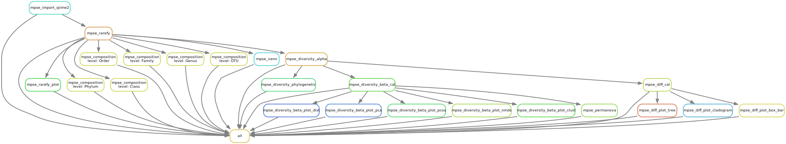
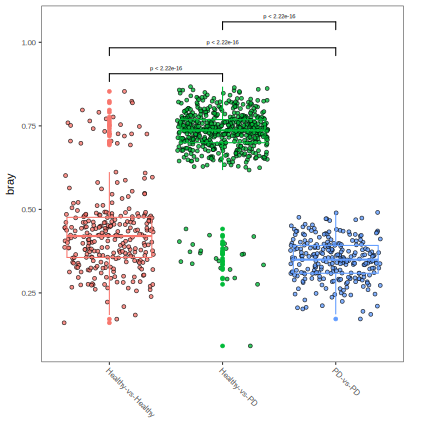

## Microbiota Process and Visualization Pipeline based on the MicrobiotaProcess R Package

### Overview

<div align=center></div>

### Installation

```bash
➤ git clone https://github.com/ohmeta/mpsepi
➤ echo "PYTHONPATH=/path/to/mpsepi:$PYTHONPATH" >> ~/.bashrc
# relogin
```

### Overview

```bash
➤ python /path/to/mpsepi/run_mpsepi.py --help

usage: mpsepi [-h] [-v]  ...

 ▄▄       ▄▄  ▄▄▄▄▄▄▄▄▄▄▄  ▄▄▄▄▄▄▄▄▄▄▄  ▄▄▄▄▄▄▄▄▄▄▄  ▄▄▄▄▄▄▄▄▄▄▄  ▄▄▄▄▄▄▄▄▄▄▄
▐░░▌     ▐░░▌▐░░░░░░░░░░░▌▐░░░░░░░░░░░▌▐░░░░░░░░░░░▌▐░░░░░░░░░░░▌▐░░░░░░░░░░░▌
▐░▌░▌   ▐░▐░▌▐░█▀▀▀▀▀▀▀█░▌▐░█▀▀▀▀▀▀▀▀▀ ▐░█▀▀▀▀▀▀▀▀▀ ▐░█▀▀▀▀▀▀▀█░▌ ▀▀▀▀█░█▀▀▀▀
▐░▌▐░▌ ▐░▌▐░▌▐░▌       ▐░▌▐░▌          ▐░▌          ▐░▌       ▐░▌     ▐░▌
▐░▌ ▐░▐░▌ ▐░▌▐░█▄▄▄▄▄▄▄█░▌▐░█▄▄▄▄▄▄▄▄▄ ▐░█▄▄▄▄▄▄▄▄▄ ▐░█▄▄▄▄▄▄▄█░▌     ▐░▌
▐░▌  ▐░▌  ▐░▌▐░░░░░░░░░░░▌▐░░░░░░░░░░░▌▐░░░░░░░░░░░▌▐░░░░░░░░░░░▌     ▐░▌
▐░▌   ▀   ▐░▌▐░█▀▀▀▀▀▀▀▀▀  ▀▀▀▀▀▀▀▀▀█░▌▐░█▀▀▀▀▀▀▀▀▀ ▐░█▀▀▀▀▀▀▀▀▀      ▐░▌
▐░▌       ▐░▌▐░▌                    ▐░▌▐░▌          ▐░▌               ▐░▌
▐░▌       ▐░▌▐░▌           ▄▄▄▄▄▄▄▄▄█░▌▐░█▄▄▄▄▄▄▄▄▄ ▐░▌           ▄▄▄▄█░█▄▄▄▄
▐░▌       ▐░▌▐░▌          ▐░░░░░░░░░░░▌▐░░░░░░░░░░░▌▐░▌          ▐░░░░░░░░░░░▌
 ▀         ▀  ▀            ▀▀▀▀▀▀▀▀▀▀▀  ▀▀▀▀▀▀▀▀▀▀▀  ▀            ▀▀▀▀▀▀▀▀▀▀▀

      Omics for All, Open Source for All

      Microbiome data process and visualization pipeline

optional arguments:
  -h, --help     show this help message and exit
  -v, --version  print software version and exit

available subcommands:

    init         init project
    mpse_wf      microbiome data process and visualization pipeline
```

### Input requirements

#### DADA2

- metadata.tsv file
- seqtab.rds file
- taxa.rds file

#### QIIME2

- metadata.tsv file
- otu.qza
- taxa.qza

#### Metaphlan/mOTU/KMCP

- metadata.tsv file
- profile

### Example (QIIME2-PD-mice)

#### Prepare data

```bash
➤ mkdir -p pd-mice
➤ cd pd-misc
➤ wget -c https://data.qiime2.org/2022.11/tutorials/pd-mice/sample_metadata.tsv
➤ wget -c https://docs.qiime2.org/2022.11/data/tutorials/pd-mice/dada2_table.qza
➤ wget -c https://docs.qiime2.org/2022.11/data/tutorials/pd-mice/taxonomy.qza
```

#### Init project

```bash
➤ python /path/to/mpsepi/run_mpsepi.py init -d .


 ▄▄       ▄▄  ▄▄▄▄▄▄▄▄▄▄▄  ▄▄▄▄▄▄▄▄▄▄▄  ▄▄▄▄▄▄▄▄▄▄▄  ▄▄▄▄▄▄▄▄▄▄▄  ▄▄▄▄▄▄▄▄▄▄▄
▐░░▌     ▐░░▌▐░░░░░░░░░░░▌▐░░░░░░░░░░░▌▐░░░░░░░░░░░▌▐░░░░░░░░░░░▌▐░░░░░░░░░░░▌
▐░▌░▌   ▐░▐░▌▐░█▀▀▀▀▀▀▀█░▌▐░█▀▀▀▀▀▀▀▀▀ ▐░█▀▀▀▀▀▀▀▀▀ ▐░█▀▀▀▀▀▀▀█░▌ ▀▀▀▀█░█▀▀▀▀
▐░▌▐░▌ ▐░▌▐░▌▐░▌       ▐░▌▐░▌          ▐░▌          ▐░▌       ▐░▌     ▐░▌
▐░▌ ▐░▐░▌ ▐░▌▐░█▄▄▄▄▄▄▄█░▌▐░█▄▄▄▄▄▄▄▄▄ ▐░█▄▄▄▄▄▄▄▄▄ ▐░█▄▄▄▄▄▄▄█░▌     ▐░▌
▐░▌  ▐░▌  ▐░▌▐░░░░░░░░░░░▌▐░░░░░░░░░░░▌▐░░░░░░░░░░░▌▐░░░░░░░░░░░▌     ▐░▌
▐░▌   ▀   ▐░▌▐░█▀▀▀▀▀▀▀▀▀  ▀▀▀▀▀▀▀▀▀█░▌▐░█▀▀▀▀▀▀▀▀▀ ▐░█▀▀▀▀▀▀▀▀▀      ▐░▌
▐░▌       ▐░▌▐░▌                    ▐░▌▐░▌          ▐░▌               ▐░▌
▐░▌       ▐░▌▐░▌           ▄▄▄▄▄▄▄▄▄█░▌▐░█▄▄▄▄▄▄▄▄▄ ▐░▌           ▄▄▄▄█░█▄▄▄▄
▐░▌       ▐░▌▐░▌          ▐░░░░░░░░░░░▌▐░░░░░░░░░░░▌▐░▌          ▐░░░░░░░░░░░▌
 ▀         ▀  ▀            ▀▀▀▀▀▀▀▀▀▀▀  ▀▀▀▀▀▀▀▀▀▀▀  ▀            ▀▀▀▀▀▀▀▀▀▀▀


      Omics for All, Open Source for All

      Microbiome data process and visualization pipeline


      Thanks for using mpsepi.

      A microbiome analysis project has been created at /home/jiezhu/toolkit/mpsepi/test/test_mpsepi_dev


      if you want to create fresh conda environments:

      mpsepi mpse_wf --conda-create-envs-only

      if you have environments:

      mpsepi mpse_wf --help

```

#### Update config.yaml

Please update input::metadata to /path/to/sample_metadata.tsv, update input::qiime2::otuqzafile to /path/to/dada2_table.qza, and update input::qiime2::taxaqzafile to /path/to/taxonomy.qza.

```bash
➤ cat config.yaml

input:
  metadata: /path/to/sample_metadata.tsv # updated
  dada2:
    seqtabfile: /path/to/seqtab.rds
    taxafile: /path/to/taxa.rds

  qiime2:
    otuqzafile: /path/to/dada2_table.qza # updated
    taxaqzafile: /path/to/taxonomy.qza # updated

  metaphlan:
    profile: /path/to/metaphlan_profile.tsv # all level or species level


params:
  import_from: qiime2   # choose from ["qiime2", "dada2", "metaphlan"]

  group: Time   # update it based on the metadata information

  rarefy:
    chunks: 500
    plot:
      width: 10
      height: 10

  diversity_alpha:
    plot:
      width: 10
      height: 10

  diversity_beta:
    distmethod: bray

  diff:
    first_test_alpha: '0.01'


output:
  import: results/00.import
  rarefied: results/00.rarefied
  composition: results/01.composition
  diversity_alpha: results/02.diversity_alpha
  diversity_beta: results/03.diversity_beta
  diff: results/04.diff


envs:
  mpse: /path/to/envs/mpse.yaml
```

#### Dry run mpse_wf

```bash
➤ python /path/to/run_mpsepi.py all --dry-run

Job stats:
job                     count    min threads    max threads
--------------------  -------  -------------  -------------
all                         1              1              1
mpse_composition            1              1              1
mpse_diff                   1              1              1
mpse_diversity_alpha        1              1              1
mpse_diversity_beta         1              1              1
mpse_import_qiime2          1              1              1
mpse_rarefy                 1              1              1
mpse_rarefy_plot            1              1              1
total                       8              1              1

Reasons:
    (check individual jobs above for details)
    input files updated by another job:
        all, mpse_composition, mpse_diff, mpse_diversity_alpha, mpse_diversity_beta, mpse_rarefy, mpse_rarefy_plot
    missing output files:
        mpse_composition, mpse_diff, mpse_diversity_alpha, mpse_diversity_beta, mpse_import_qiime2, mpse_rarefy, mpse_rarefy_plot

This was a dry-run (flag -n). The order of jobs does not reflect the order of execution.
```

#### Run mpse_wf

```bash
➤ python /path/to/run_mpsepi.py all \
  --use-conda \
  --run-local \
  --cores 10 \
  --jobs 10
```

#### Understand output

```bash
tree results

results/
├── 00.import
│   ├── benchmark
│   │   └── mpse_import_qiime2_benchmark.txt
│   └── mpse
│       └── mpse.rds
├── 00.rarefied
│   ├── benchmark
│   │   ├── mpse_rarefy_benchmark.txt
│   │   └── mpse_rarefy_plot_benchmark.txt
│   ├── mpse
│   │   └── mpse_rarefied.rds
│   └── plot
│       ├── mpse_rarefied.pdf
│       ├── mpse_rarefied.png
│       └── mpse_rarefied.svg
├── 01.composition
│   ├── abun_plot
│   │   ├── composition_genus.pdf
│   │   ├── composition_genus.png
│   │   ├── composition_genus.svg
│   │   ├── composition_phylum.pdf
│   │   ├── composition_phylum.png
│   │   ├── composition_phylum.svg
│   │   ├── composition_species.pdf
│   │   ├── composition_species.png
│   │   └── composition_species.svg
│   ├── group_plot
│   │   ├── composition_genus.pdf
│   │   ├── composition_genus.png
│   │   ├── composition_genus.svg
│   │   ├── composition_phylum.pdf
│   │   ├── composition_phylum.png
│   │   ├── composition_phylum.svg
│   │   ├── composition_species.pdf
│   │   ├── composition_species.png
│   │   └── composition_species.svg
│   ├── heatmap_plot
│   │   ├── composition_genus.pdf
│   │   ├── composition_genus.png
│   │   ├── composition_genus.svg
│   │   ├── composition_phylum.pdf
│   │   ├── composition_phylum.png
│   │   ├── composition_phylum.svg
│   │   ├── composition_species.pdf
│   │   ├── composition_species.png
│   │   └── composition_species.svg
│   ├── image
│   │   └── composition.RData
│   └── mpse
│       └── mpse.rds
├── 02.diversity_alpha
│   ├── image
│   │   └── diversity_alpha.RData
│   ├── mpse
│   │   ├── diversity_alpha.tsv
│   │   └── mpse.rds
│   └── plot
│       ├── diversity_alpha.pdf
│       ├── diversity_alpha.png
│       └── diversity_alpha.svg
├── 03.diversity_beta
│   ├── clust_plot
│   │   ├── clust.pdf
│   │   ├── clust.png
│   │   └── clust.svg
│   ├── dist_plot
│   │   ├── dist_groups.pdf
│   │   ├── dist_groups.png
│   │   ├── dist_groups.svg
│   │   ├── dist_samples.pdf
│   │   ├── dist_samples.png
│   │   └── dist_samples.svg
│   ├── image
│   │   └── diversity_beta.RData
│   ├── mpse
│   │   └── dist.tsv
│   └── pcoa_plot
│       ├── pcoa.pdf
│       ├── pcoa.png
│       └── pcoa.svg
└── 04.diff
    ├── box_bar_plot
    │   ├── diff_box_bar.pdf
    │   ├── diff_box_bar.png
    │   └── diff_box_bar.svg
    ├── cladogram_plot
    │   ├── diff_cladogram.pdf
    │   ├── diff_cladogram.png
    │   └── diff_cladogram.svg
    ├── image
    │   └── diff.RData
    ├── mpse
    │   └── lda.tsv
    └── tree_plot
        ├── diff_tree.pdf
        ├── diff_tree.png
        └── diff_tree.svg
```

### Visualization

#### Rarefication curve
<div align=center></div>

#### Composition

##### Phylum

<div align=center></div>

##### Phylum group

<div align=center></div>


#### Alpha Diversity

<div align=center></div>

#### Beta Diversity

##### Distance Samples

<div align=center></div>

##### Distance Groups

<div align=center></div>


##### Pcoa

<div align=center></div>

##### Clust

<div align=center></div>
